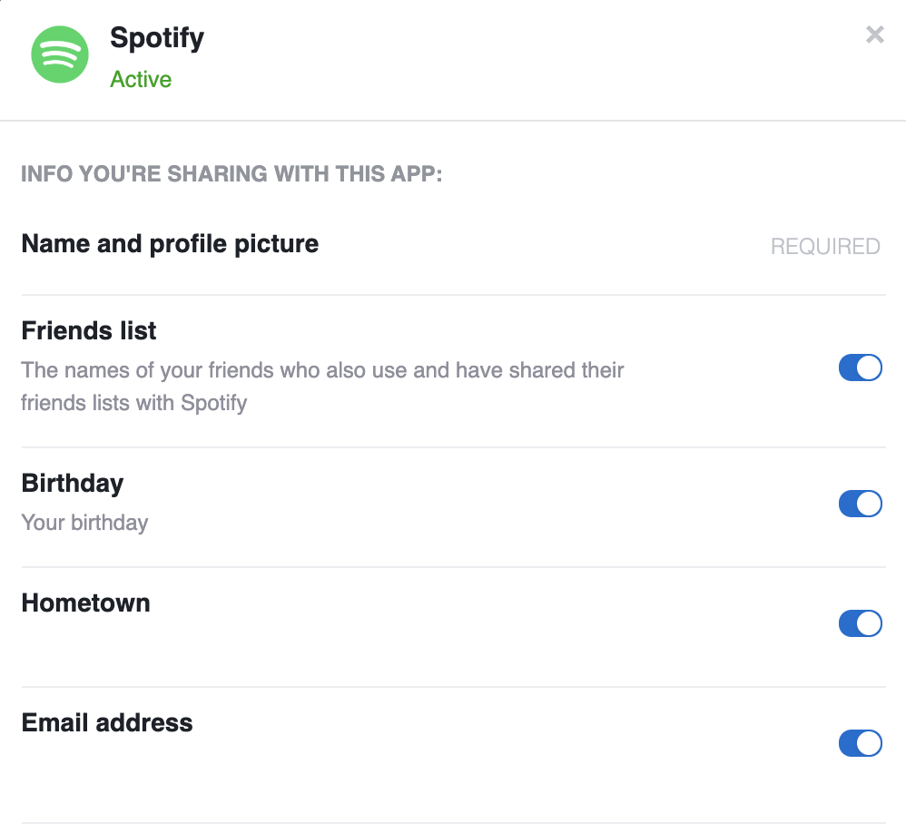
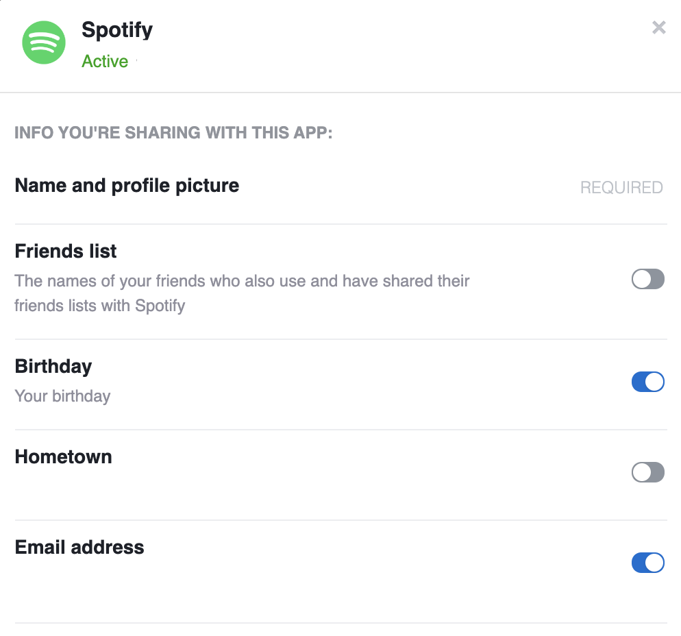

# Goal

The goal of this study is to determine the minimal set of permissions required to successfuly login into a website/webservice without providing unnecessary private information.

This is because certain services ask you for more permissions than what is required to successfully authenticate you as a user. 

**Example:** 

Spotify by default asks for information such as Hometown, Friends List, Birthday, Email etc.

However, it also works if you choose not to provide Friends List and Hometown as these permissions are not important for the account creation on Spotify. 

This minimal set of permissions is important to understand what information is required.

Once we have the information regarding the minimal permissions needed, our privacy plugin will be able to assist you in determining the required permissions. 

# Installation
Please install the following extentions:

1. deprinfo
    - Follow the instructions [here](./usage.md).
2. defender
    - Download the zip file [here](./assets/files/defender.zip).
    - Unzip the file
    - Open Chrome and go to Settings-> More Tools-> Extensions
    - Click on **Load Unpacked**.
    - Select the folder and click Select.

# Usage

1. Login into a website of your choice using facebook. It will present you with a dialog box that will give you options to select or deselect permissions. Select the minimal amount of permissions you wish you provide and continue.

2. Once you are logged in, click on the defender plugin and it will show you the name of the website you logged in into and ask you if it worked or not. 

3. Click on **Working** if you were successfully able to login with the permissions you selected on facebook login dialog box. Else click on **Report Failure**. You also have a choice to submit a additional (optional) comment with your submission. 

This study will help us determine what permissions are working for what websites along with the usefulness of the plugin. 

You can view the current websites using your facebook permissions and the list oof permissions in the deprinfo plugin. 

